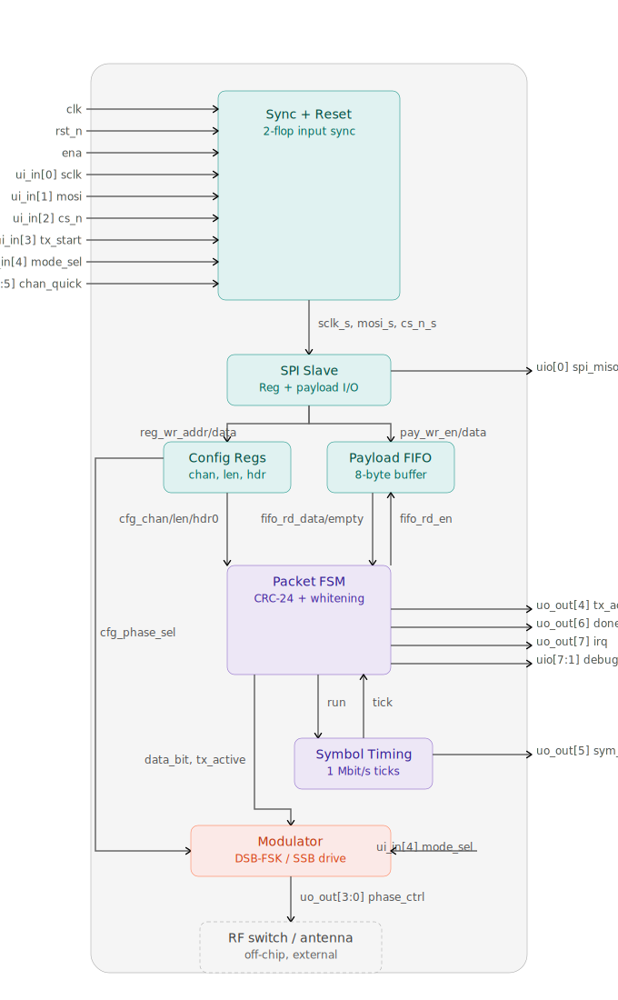

   

# BLE Backscatter Radio Modem

A digital baseband + backscatter-switch controller for a BLE advertising-channel backscatter
tag, built as a TinyTapeout 1×2 SKY130 tile. It assembles a BLE advertising PDU (preamble,
access address, header, payload, CRC-24, whitening) on the fly — no full-packet buffer — and
drives a 4-line RF switch in either a DSB-FSK or an SSB harmonic-reject pattern.

- [Full pin/register reference — docs/info.md](docs/info.md)
- [Design notes, decisions, and dev workflow — NOTES.md](NOTES.md)

## Block diagram



All `tt_um_ble_backscatter_modem` tile pins are labeled on the diagram boundary and linked
to the block that drives or consumes them. Two simplifications worth knowing: `irq` and
`uio[7:1] debug` are drawn from Packet FSM only, but both are actually ORs/concatenations
that also pull from Payload FIFO (`irq = done | fifo_full`; `debug` includes
`fifo_empty`/`fifo_full`); and `ui_in[4] mode_sel` is shown entering `Modulator` directly,
which is the synchronized-pin path — SPI can also drive it via `cfg_mode_sel` (see
[config_regs.v](src/config_regs.v)).

## How it works, by block

| Block | File | What it does |
|---|---|---|
| Sync + Reset | [sync_reset.v](src/sync_reset.v) | 2-flop synchronizes every async input (SPI pins, `tx_start`, `mode_sel`, `chan_quick`) into the `clk` domain; combines `rst_n` and `ena` into one internal reset so dropping `ena` returns the design to idle. |
| SPI Slave | [spi_slave.v](src/spi_slave.v) | Oversampled SPI mode 0 slave. One command byte (`R/W` + 7-bit address) per transaction, then an auto-incrementing register burst, or — for the payload address — a held-address burst that streams straight into the FIFO. |
| Config Regs | [config_regs.v](src/config_regs.v) | The `CTRL`/`STATUS`/`CHAN`/`LEN`/`PHASE_CFG`/`PDU_HDR` register file. Latches channel, payload length, PDU header byte, mode/repeat/phase-config bits, and the one-cycle `tx_start` pulse. |
| Payload FIFO | [payload_fifo.v](src/payload_fifo.v) | 8-byte synchronous FIFO between the host and the packet FSM. This is the whole point of the streaming design — no 37-byte PDU buffer — so the FSM stalls (backpressure) rather than underruns if the host falls behind. |
| Packet FSM | [packet_fsm.v](src/packet_fsm.v) | The sequencer: `IDLE → PREAMBLE → ACCESS → HEADER → PAYLOAD → CRC → DONE`. Assembles the header via [pdu_assembler.v](src/pdu_assembler.v), runs [crc24.v](src/crc24.v) and [whitening_lfsr.v](src/whitening_lfsr.v) per bit, and emits one whitened `data_bit` per `sym_tick`. `repeat_en` re-arms straight back into `PREAMBLE` after `DONE` (host must re-stream the payload for each iteration). |
| Symbol Timing | [symbol_timing.v](src/symbol_timing.v) | Divides `clk` down to the 1 Mbit/s symbol rate. Freezes in lock-step with the packet FSM's `run` signal during a FIFO stall, so the emitted bit sequence is host-timing-independent. |
| Modulator | [modulator.v](src/modulator.v), [phase_generator.v](src/phase_generator.v) | Drives `phase_ctrl[3:0]`. `mode_sel` picks the waveform shape — DSB-FSK (single line + complement, frequency-keyed by the data bit) or 4-phase SSB harmonic-reject (rotating phasor, direction-keyed by the data bit). `cfg_phase_sel` (SPI `PHASE_CFG` bit 0) independently picks **Config A** (default: SSB @ 16 MHz, DSB keyed 16/10.67 MHz) or **Config B** (DSB keyed 32/16 MHz, ~24 MHz center — SSB is unchanged, since Config A's divider is already the fastest this clock supports). |

## How to test

11 cocotb tests in [test/test.py](test/test.py) run against Icarus Verilog, checking RTL
behavior bit-for-bit against the independent Python reference in
[test/golden_model.py](test/golden_model.py):

| Test | Verifies |
|---|---|
| `test_reset_and_idle` | Safe idle state after reset (`phase_ctrl`, `tx_active` = 0). |
| `test_spi_config_readwrite` | SPI register read/write round-trips. |
| `test_packet_transmission_ch37` / `_ch38` | Full packet bitstream matches the golden model bit-for-bit, including whitening seeded from the channel index. |
| `test_ssb_4phase_modulation` | SSB mode actually rotates through more than 4 phase states. |
| `test_dsb_fsk_modulation` | DSB mode's two output lines stay complementary. |
| `test_config_b_phase_select` | `PHASE_CFG` bit 0 changes real hardware behavior — measures the actual `phase_ctrl[0]` toggle period and checks it against Config A's `{2,3}`-cycle and Config B's `{1,2}`-cycle divider sets, not just that the register bit is writable. |
| `test_payload_fifo_backpressure` | A FIFO underrun genuinely stalls the symbol clock (`run` deasserts) rather than emitting garbage, and resumes correctly once more payload arrives. |
| `test_repeat_transmission` | `repeat_en` re-arms into a second transmission on its own, and stops cleanly once cleared. |
| `test_max_payload_length` | The full 37-byte `MAX_PAYLOAD_BYTES` payload streams correctly despite the 8-byte FIFO, when the host paces writes against `fifo_full`. |
| `test_reset_mid_transmission` | An async reset mid-packet returns to safe idle with no residual state, and a following transmission is unaffected. |

### Running the tests

This repo lives under OneDrive; running `iverilog`/cocotb from WSL directly against
`/mnt/c/...` into a OneDrive-synced path is extremely slow (9P bridge + OneDrive sync hooks
on every file touch) — enough to make a test run hang or get killed mid-suite. From
PowerShell, [scripts/run_sim.ps1](scripts/run_sim.ps1) rsyncs the repo into the WSL distro's
native filesystem first (takes well under a second) and runs `make` there instead:

```powershell
scripts/run_sim.ps1            # RTL sim, all tests
scripts/run_sim.ps1 -Gates     # gate-level sim (after a GDS build)
```

Or manually, from inside WSL (native filesystem, not `/mnt/c/...`):

```bash
cd test && make
```

See [NOTES.md](NOTES.md) for the full writeup of past bugs, the WSL/OneDrive performance
issue, and design decisions.

---

## What is Tiny Tapeout?

Tiny Tapeout is an educational project that aims to make it easier and cheaper than ever to get your digital and analog designs manufactured on a real chip.

To learn more and get started, visit https://tinytapeout.com.

## Resources

- [FAQ](https://tinytapeout.com/faq/)
- [Digital design lessons](https://tinytapeout.com/digital_design/)
- [Learn how semiconductors work](https://tinytapeout.com/siliwiz/)
- [Join the community](https://tinytapeout.com/discord)
- [Build your design locally](https://www.tinytapeout.com/guides/local-hardening/)
